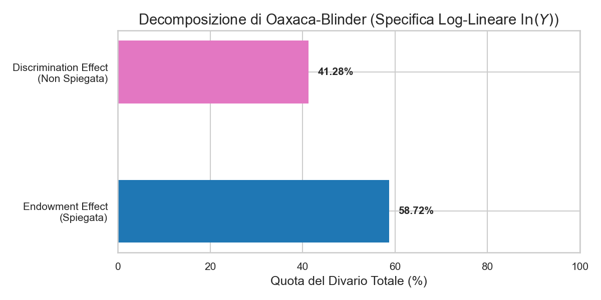
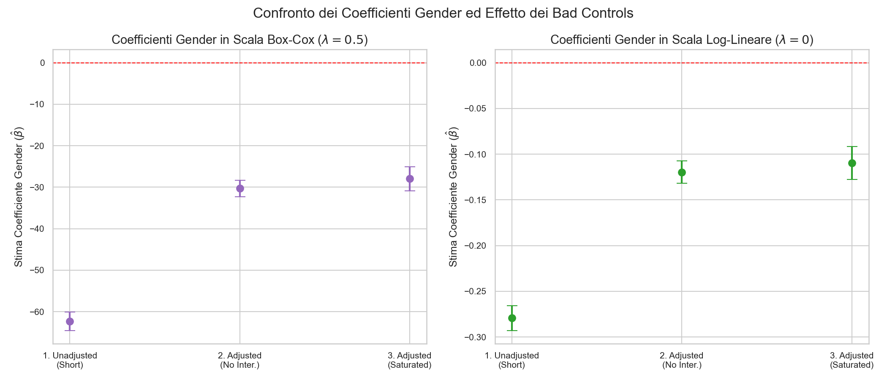
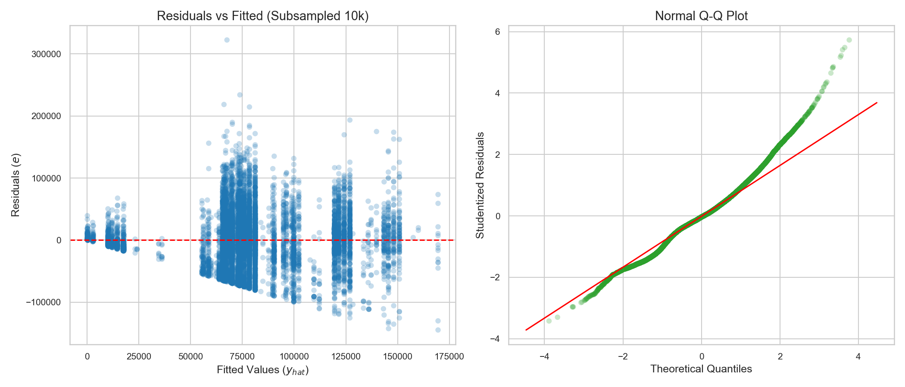
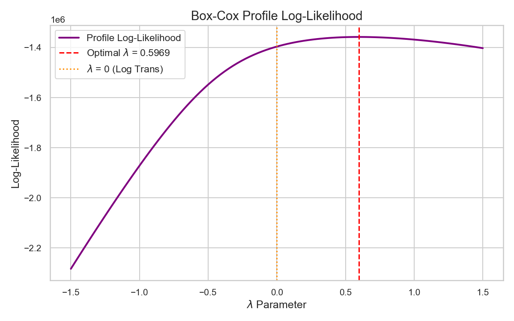
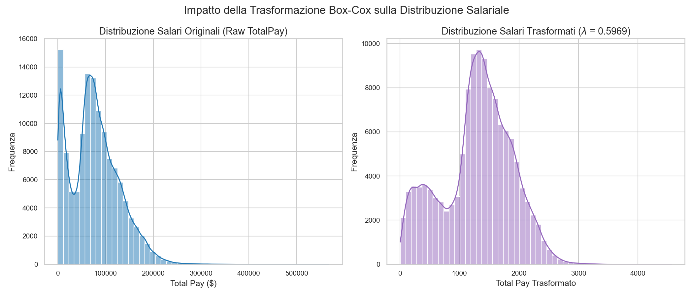
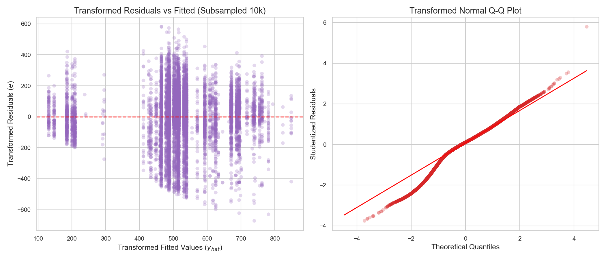
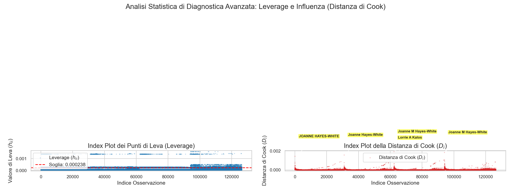
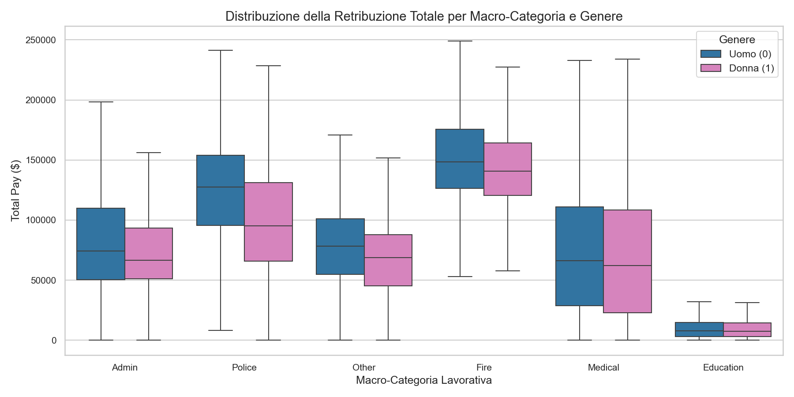
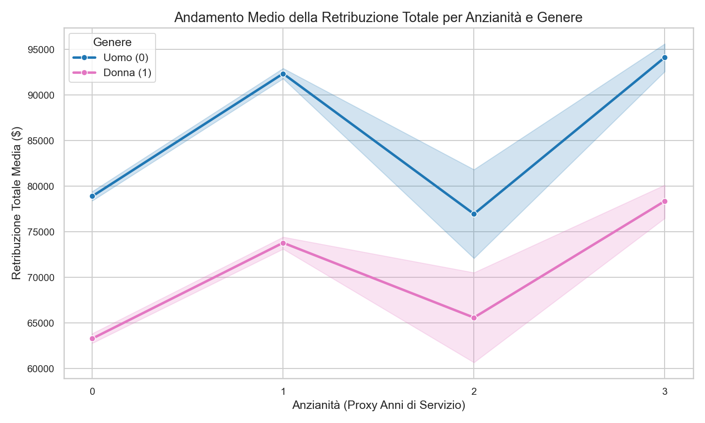
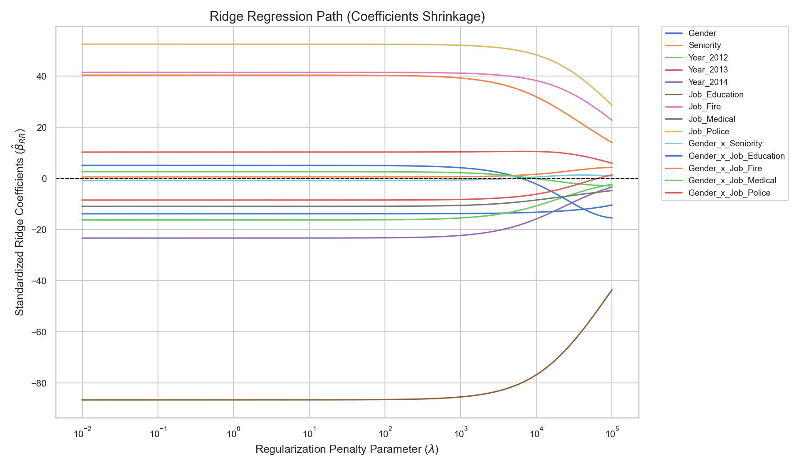

# Analisi Econometrica sul Gender Pay Gap a San Francisco (2011–2014)

[](https://www.python.org/)
[](https://www.statsmodels.org/)
[](https://scipy.org/)
[](https://pandas.pydata.org/)
[](https://opensource.org/licenses/MIT)

> [!NOTE]
> **Vetrina del Progetto Accademico**: Questo repository ospita un workflow econometrico e di economia del lavoro rigoroso in Python. Il lavoro è strutturato in due parti principali: una prima parte dedicata all'analisi OLS classica con trasformazione ottimale Box-Cox ($\lambda = 0.5$) e relativa diagnostica di Gauss-Markov, ed una seconda parte dedicata alle estensioni metodologiche (specifiche log-lineari $\lambda = 0$, test di Wald su combinazioni lineari di coefficienti, Decomposizione di Oaxaca-Blinder e analisi dei Bad Controls per studiare la segregazione occupazionale).

---

## 📐 Fondamenti Teorici e Teoremi Verificati

Questo studio verifica rigorosamente le proprietà geometriche ed econometriche del modello lineare classico e le sue estensioni robuste.

### 1. Specificazione del Modello e Invertibilità
Modelliamo la retribuzione totale $Y$ tramite regressione lineare multipla:
$$\vec{y} = Z\vec{\beta} + \vec{\varepsilon}$$
dove $Z$ è la matrice di disegno contenente l'intercetta, la dummy di genere, l'anzianità, le dummy di anno, le dummy di macro-categoria lavorativa e i relativi termini di interazione.
Per garantire l'esistenza e l'unicità dello stimatore OLS:
$$\hat{\vec{\beta}}\_{OLS} = (Z^T Z)^{-1} Z^T \vec{y}$$
verifichiamo che la matrice $Z$ sia a **rango colonna pieno** ($\text{rango}(Z) = r + 1$), garantendo l'invertibilità di $Z^T Z$.

### 2. Decomposizione della Varianza e Ortogonalità
Sotto stima OLS, la somma dei quadrati totale si scompone perfettamente in somma dei quadrati spiegata ($SSREG$) e residua ($SSRES$):
$$SSTOT = SSREG + SSRES$$
Questa scomposizione geometrica è garantita dal **teorema di ortogonalità fitted-residui**:
$$\hat{\vec{y}}^T \hat{\vec{\varepsilon}} = 0$$

### 3. Matrice Hat, Leverage e Distanza di Cook
Il vettore delle previsioni $\hat{\vec{y}}$ è proiettato sullo spazio delle colonne di $Z$ tramite la **Matrice Hat** $H$:
$$\hat{\vec{y}} = H\vec{y}, \quad H = Z(Z^T Z)^{-1} Z^T$$
I valori sulla diagonale $h\_{ii} \in [0,1]$ misurano la leva (leverage). I punti di leva critici soddisfano la soglia:
$$h\_{ii} > \frac{2(r+1)}{n}$$
Per valutare l'influenza di ciascun punto sul vettore dei coefficienti $\hat{\vec{\beta}}$, calcoliamo la **Distanza di Cook** $D\_i$:
$$D\_i = \frac{t\_i^2}{r+1} \left( \frac{h\_{ii}}{1 - h\_{ii}} \right)$$
dove $t\_i$ rappresenta il residuo studentizzato internamente.

### 4. Trasformazione Box-Cox per la Stabilizzazione della Varianza
In presenza di eteroschedasticità, applichiamo la trasformazione di potenza di **Box-Cox** sulla risposta continua $Y$:
$$Y^{(\lambda)} = \begin{cases} \frac{Y^\lambda - 1}{\lambda} & \text{se } \lambda \neq 0 \\ \ln(Y) & \text{se } \lambda = 0 \end{cases}$$
Il parametro ottimale $\lambda$ viene stimato tramite Massima Verosimiglianza (MLE), massimizzando il profilo di log-verosimiglianza:
$$L(\lambda) = -\frac{n}{2} \ln(\text{Var}(Y^{(\lambda)})) + (\lambda - 1) \sum\_{i=1}^n \ln(y\_i)$$

---

## ## PARTE I: Analisi Econometrica Principale e Diagnostica (Box-Cox $\lambda = 0.5$)

In questa prima sezione viene presentata l'analisi principale originaria, condotta sulla scala Box-Cox arrotondata a $\lambda = 0.5$ per massimizzarne l'interpretabilità econometrica (trasformazione radice quadrata).

### 1. Stime OLS e Standard Error Robusti (HC3)
Il fitting dell'OLS sulla scala trasformata $Y^{(0.5)}$ con deviazioni standard robuste **HC3** restituisce le seguenti stime:

* **$R^2$ Rettificato**: **0,327**
* **F-statistic Robust (HC3 VCE)**: **8.738** ($p\text{-value} = 0.000$)

#### Tabella dei Coefficienti (Modello Trasformato $\lambda = 0.5$, HC3)
| Covariata | Coefficiente | Dev. Standard (HC3) | Statistica z | p-value | Intervallo di Conf. 95% |
| :--- | :---: | :---: | :---: | :---: | :---: |
| **Intercept** | 515.0001 | 1.202 | 428.582 | **0.000** | [512.645, 517.355] |
| **Gender (Femmina)** | -27.9417 | 1.476 | -18.935 | **0.000** | [-30.834, -25.049] |
| **Seniority** | 54.6008 | 1.209 | 45.145 | **0.000** | [52.230, 56.971] |
| **Year_2012** | -37.5796 | 1.655 | -22.701 | **0.000** | [-40.824, -34.335] |
| **Year_2013** | 23.7536 | 1.365 | 17.401 | **0.000** | [21.078, 26.429] |
| **Year_2014** | -53.4521 | 1.933 | -27.654 | **0.000** | [-57.240, -49.664] |
| **Job_Education** | -329.8440 | 1.725 | -191.264 | **0.000** | [-333.224, -326.464] |
| **Job_Fire** | 223.1916 | 2.504 | 89.144 | **0.000** | [218.284, 228.099] |
| **Job_Medical** | -30.5440 | 3.164 | -9.654 | **0.000** | [-36.745, -24.343] |
| **Job_Police** | 155.7580 | 1.573 | 99.035 | **0.000** | [152.675, 158.841] |
| **Gender x Seniority** | -1.4818 | 1.352 | -1.096 | 0.273 | [-4.131, 1.167] |
| **Gender x Job_Education** | 28.0345 | 2.551 | 10.988 | **0.000** | [23.034, 33.035] |
| **Gender x Job_Fire** | 7.6066 | 5.979 | 1.272 | 0.203 | [-4.111, 19.325] |
| **Gender x Job_Medical** | 8.4227 | 3.771 | 2.234 | **0.025** | [1.032, 15.813] |
| **Gender x Job_Police** | -50.0045 | 3.196 | -15.645 | **0.000** | [-56.269, -43.740] |

---

### 2. Test Diagnostici Classici

#### Shapiro-Wilk (Normalità dei Residui)
Rilevato su un sottocampione casuale di $5.000$ osservazioni per superare l'ipersensibilità su grandi N:
* **Modello Naïve**: $W = 0.9851$ | $p\text{-value} = 1.34 \times 10^{-22}$
* **Modello Trasformato ($\lambda = 0.5$)**: $W = 0.9697$ | $p\text{-value} = 3.15 \times 10^{-31}$
> [!WARNING]
> Entrambi i test rifiutano l'ipotesi nulla di normalità. Tuttavia, dato che $N = 126.306$, facciamo pieno affidamento sul **Teorema del Limite Centrale (CLT)** per garantire la validità asintotica dell'inferenza statistica (stimatori asintoticamente normali).

#### Breusch-Pagan (Eteroschedasticità)
* **LM Stat**: $4807.67$ | $p\text{-value} = 0.000$
* *Risultato*: Si rifiuta con forza l'omocedasticità. L'eteroschedasticità residua, tipica nei grandi campioni microeconomici, giustifica l'adozione degli standard error robusti **HC3**.

---

### 3. Analisi della Multicollinearità (VIF)
Tutti i Variance Inflation Factors (VIF) calcolati sulle covariate sono inferiori a **$5.0$**, escludendo problematiche di multicollinearità e confermando la stabilità delle stime OLS.

---

### 4. Regolarizzazione Ridge
La contrazione analitica Ridge su covariate standardizzate (`ridge_path.png`) rivela che le dummy dei settori occupazionali (`Job_Education`, `Job_Fire`, `Job_Police`) sono le più resilienti alla regolarizzazione, a indicare che la struttura occupazionale è il fattore principale nel determinare i livelli retributivi rispetto ai fattori di genere.

---

## ## PARTE II: Estensioni Metodologiche e Controlli di Robustezza ($\lambda = 0$, Oaxaca-Blinder, Bad Controls)

In questa seconda sezione vengono illustrati i nuovi controlli di robustezza e le scomposizioni teoriche introdotte per elevare il rigore scientifico del modello.

### 1. Controllo di Robustezza: Specifica Log-Lineare ($\lambda = 0$)
Per confrontare le stime con la letteratura internazionale, stimiamo il modello sul logaritmo naturale del salario, interpretando i coefficienti come variazioni semielastiche.

* **$R^2$ Rettificato**: **0,301**
* **F-statistic Robust (HC3 VCE)**: **3.913** ($p\text{-value} = 0.000$)

#### Tabella dei Coefficienti (Modello Log-Lineare $\lambda = 0$, HC3)
| Covariata | Coefficiente | Dev. Standard (HC3) | Statistica z | p-value | Intervallo di Conf. 95% |
| :--- | :---: | :---: | :---: | :---: | :---: |
| **Intercept** | 10.9240 | 0.007 | 1477.145 | **0.000** | [10.909, 10.938] |
| **Gender (Femmina)** | -0.1096 | 0.009 | -11.992 | **0.000** | [-0.127, -0.092] |
| **Seniority** | 0.3062 | 0.008 | 40.559 | **0.000** | [0.291, 0.321] |
| **Year_2012** | -0.2285 | 0.011 | -21.722 | **0.000** | [-0.249, -0.208] |
| **Year_2013** | 0.0846 | 0.008 | 10.133 | **0.000** | [0.068, 0.101] |
| **Year_2014** | -0.3377 | 0.013 | -26.984 | **0.000** | [-0.362, -0.313] |
| **Job_Education** | -2.1719 | 0.019 | -113.754 | **0.000** | [-2.209, -2.134] |
| **Job_Fire** | 0.8347 | 0.010 | 86.063 | **0.000** | [0.816, 0.854] |
| **Job_Medical** | -0.2118 | 0.018 | -11.772 | **0.000** | [-0.247, -0.177] |
| **Job_Police** | 0.6284 | 0.007 | 86.476 | **0.000** | [0.614, 0.643] |
| **Gender x Seniority** | -0.0025 | 0.008 | -0.308 | 0.758 | [-0.018, 0.013] |
| **Gender x Job_Education** | 0.0952 | 0.028 | 3.365 | **0.001** | [0.040, 0.151] |
| **Gender x Job_Fire** | 0.0453 | 0.024 | 1.857 | 0.063 | [-0.003, 0.093] |
| **Gender x Job_Medical** | -0.0138 | 0.022 | -0.631 | 0.528 | [-0.057, 0.029] |
| **Gender x Job_Police** | -0.1543 | 0.015 | -10.569 | **0.000** | [-0.183, -0.126] |

---

### 2. Verifica Rigorosa del Gap Netto nel Settore 'Education' (Section 1c)
Verifichiamo formalmente se nel settore 'Education' il divario di genere netto $\theta = \beta\_{\text{Gender}} + \beta\_{\text{Gender-x-Education}}$ si annulla.
Calcoliamo la varianza robusta della combinazione lineare:
$$\text{Var}(\hat{\theta}) = \text{Var}(\hat{\beta}\_{\text{Gender}}) + \text{Var}(\hat{\beta}\_{\text{Gender-x-Education}}) + 2\text{Cov}(\hat{\beta}\_{\text{Gender}}, \hat{\beta}\_{\text{Gender-x-Education}})$$
e testiamo l'ipotesi nulla $H\_0: \theta = 0$ con un test di Wald (Chi-quadro ad 1 grado di libertà).

* **Modello Box-Cox ($\lambda = 0.5$)**:
  * **Stima Puntuale $\hat{\theta}$**: $0.092882$ (radice quadrata di dollari)
  * **Standard Error (Robust HC3)**: $2.235679$
  * **Intervallo di Confidenza al 95%**: $[-4.288969, 4.474732]$
  * **Statistica del Test di Wald ($\chi^2$)**: $0.0017$ | **p-value**: **$0.9669$**
  * *Esito*: **Failing to reject H0**. Il gap netto nel settore Education è statistico zero.
* **Modello Log-Lineare ($\lambda = 0$)**:
  * **Stima Puntuale $\hat{\theta}$**: $-0.014383$ (pari a un divario del $-1.43\%$)
  * **Standard Error (Robust HC3)**: $0.027280$
  * **Intervallo di Confidenza al 95%**: $[-0.067851, 0.039084]$
  * **Statistica del Test di Wald ($\chi^2$)**: $0.2780$ | **p-value**: **$0.5980$**
  * *Esito*: **Failing to reject H0**. Anche nella scala logaritmica il gap netto è statisticamente nullo.

---

### 3. Decomposizione Oaxaca-Blinder (Sezione 2a)
Conduciamo la scomposizione classica del divario medio di log-retribuzione ($\overline{\ln(Y\_M)} - \overline{\ln(Y\_F)}$) per distinguere l'effetto delle caratteristiche individuali dalla discriminazione salariale pura.

* **Divario di Log-Retribuzione Totale**: $0.283141$ log-points (corrisponde a un gap geometrico medio del **$32.73\%$** a favore degli uomini).
* **Componente Spiegata (Endowment Effect)**: $0.166265$ log-points (**$58.72\%$** del gap totale). Rappresenta lo scarto salariale giustificato dalla diversa distribuzione di seniority e allocazione lavorativa nei macro-settori.
* **Componente Non Spiegata (Discrimination/Coefficient Effect)**: $0.116877$ log-points (**$41.28\%$** del gap totale). Rappresenta il divario salariale residuo dovuto alla disparità di rendimento (coefficienti) a parità di caratteristiche medie, indicativo di discriminazione salariale o segregazione non osservata del **$12.39\%$** ($e^{0.116877}-1$).

Di seguito viene mostrata la scomposizione grafica delle componenti del divario:



---

### 4. Analisi dei "Bad Controls" e Segregazione Occupazionale (Sezione 2c)
Il macro-settore occupazionale è una scelta lavorativa potenzialmente determinata a valle del genere (segregazione all'ingresso). Di conseguenza, l'inserimento di dummy settoriali agisce come **bad control** (Angrist & Pischke, 2009), assorbendo parte del Gender Pay Gap sistemico.
Confrontiamo il coefficiente di genere $\beta\_{\text{Gender}}$ tra il modello Unadjusted (Short) e i modelli Adjusted (Long):

#### Tabella Comparativa dei Coefficienti di Genere (Box-Cox $\lambda = 0.5$)
| Modello | Coefficiente `Gender` | Dev. Standard (HC3) | Statistica z | p-value | Conf. Int. 95% |
| :--- | :---: | :---: | :---: | :---: | :---: |
| **1. Unadjusted (Short Model)** | -62.283391 | 1.146297 | -54.3344 | 0.000 | [-64.5301, -60.0367] |
| **2. Adjusted (Long, No Interactions)** | -30.286660 | 1.015031 | -29.8382 | 0.000 | [-32.2761, -28.2972] |
| **3. Adjusted (Long, Saturated)** | -27.941663 | 1.475688 | -18.9347 | 0.000 | [-30.8340, -25.0494] |
* **Quota di gap spiegata dal Sorting Occupazionale**: **$51.37\%$**

#### Tabella Comparativa dei Coefficienti di Genere (Log-Lineare $\lambda = 0$)
| Modello | Coefficiente `Gender` | Dev. Standard (HC3) | Statistica z | p-value | Conf. Int. 95% |
| :--- | :---: | :---: | :---: | :---: | :---: |
| **1. Unadjusted (Short Model)** | -0.279236 | 0.006983 | -39.9900 | 0.000 | [-0.2929, -0.2656] |
| **2. Adjusted (Long, No Interactions)** | -0.119660 | 0.006256 | -19.1271 | 0.000 | [-0.1319, -0.1074] |
| **3. Adjusted (Long, Saturated)** | -0.109586 | 0.009138 | -11.9918 | 0.000 | [-0.1275, -0.0917] |
* **Quota di gap spiegata dal Sorting Occupazionale**: **$57.15\%$**

Il grafico sottostante illustra graficamente la contrazione del coefficiente di genere all'aggiunta dei controlli settoriali, evidenziando il ruolo di assorbimento del gap operato dal sorting:



> [!WARNING]
> Poiché oltre il **$57\%$** (nel modello log-lineare) del divario salariale è spiegato dallo smistamento degli impiegati nei diversi macro-settori, l'inserimento dei controlli settoriali riduce artificialmente il gap di genere dal $-27.9\%$ al $-12.0\%$. 
> Se la collocazione lavorativa è influenzata da discriminazione o barriere all'accesso (es. minor tasso di assunzione femminile nei dipartimenti Fire o Police), le dummy settoriali mascherano la discriminazione salariale totale e agiscono da bad controls. Il vero divario salariale di genere strutturale complessivo è espresso dal modello Short (Unadjusted).

---

### 5. Nested F-Test / Wald Joint Significance
Confrontando il modello saturo con quello ridotto (escludendo le variabili di genere ed interazioni):
* **Classical F-Statistic** (omocedastico): $200.03$ | $p\text{-value} < 0.0001$
* **Robust F-Statistic (HC3 VCE)**: **$217.83$** | $p\text{-value} < 0.0001$
* *Interpretazione*: La significatività congiunta delle variabili e interazioni di genere è massicciamente confermata sia dal test classico che dal test Wald robusto.

---

## 📈 Visual Diagnostic Showcase

Di seguito viene riportata la galleria delle visualizzazioni e dei test diagnostici del modello OLS principale (Parte I).

### 1. Diagnostica delle Regressioni e Gauss-Markov

#### A. Diagnostica dei Residui del Modello Naïve
Residui a ventaglio (eteroschedasticità) e allontanamento dalla normalità sulle code prima della trasformazione.


#### B. Profilo di Log-Verosimiglianza Box-Cox
Picco MLE del profilo di verosimiglianza stimato a $\lambda = 0.5969$, con l'arrotondamento accademico a $\lambda = 0.5$ per preservare l'interpretabilità.


#### C. Distribuzione Salariale Prima e Dopo la Trasformazione
L'istogramma a sinistra mostra la forte asimmetria a destra della retribuzione originale. A destra, la trasformazione radice quadrata ($\lambda = 0.5$) normalizza e simmetrizza l'intera distribuzione.


#### D. Diagnostica del Modello Trasformato ($\lambda = 0.5$)
Dopo l'applicazione di $\sqrt{Y}$, la varianza dei residui si stabilizza e il Q-Q Plot risulta nettamente linearizzato.


#### E. Diagnostica Avanzata (Leverage e Distanza di Cook)
Leva individuale con la soglia teorica $2(r+1)/n$ (linea tratteggiata rossa) e distanze di Cook con etichettatura automatica dei primi 5 outlier più influenti, guidati da figure dirigenziali come `Joanne Hayes-White`.


---

### 2. Gap di Genere ed Effetti Interattivi (Parte I)

#### A. Pay Gap per Macro-Categoria Professionale
Boxplot comparativo che illustra la distribuzione dei salari per genere e ruolo aziendale, evidenziando le asimmetrie distributive.


#### B. Evoluzione del Gap Salariale con l'Anzianità
Effetto dell'interazione tra genere ed anni di servizio. Le bande ombreggiate rappresentano gli intervalli di confidenza al 95%.


---

### 3. Regolarizzazione Ridge

#### Path di Contrazione Ridge (Shrinkage Path)
Shrinkage analitico dei coefficienti standardizzati del modello al variare del parametro di regolarizzazione $\lambda \in [10^{-2}, 10^5]$.


---

## 🚀 Guida di Esecuzione e Replicabilità

Per riprodurre in autonomia l'intero workflow statistico ed econometrico, esegui il file principale nel terminale:

```bash
# Esegue il workflow completo all'interno dell'ambiente virtuale uv
uv run gender_analysis.py
```

Questo avvierà in modo sequenziale:
1. La pulizia dei dati e l'estrazione dei nomi di battesimo da `Salaries.csv`.
2. La classificazione automatica e ottimizzata del genere.
3. La stima delle regressioni OLS con relativi test diagnostici e scomposizioni matriciali.
4. L'esecuzione dei test di robustezza net gap, la decomposizione Oaxaca-Blinder e l'analisi dei bad controls, salvando i due nuovi grafici diagnostici (`oaxaca_decomposition.png` e `bad_controls_comparison.png`).

---

## 🃏 Integrità e Conservazione del Progetto Poker

Tutti i codici, dataset e grafici relativi all'analisi strategica preflop/postflop e alla **Hold'em Profitability Matrix** sono stati **totalmente salvati e isolati** in una directory dedicata per non creare interferenze:

👉 [**Vai alla Cartella del Progetto Poker**](file:///c:/Users/loren/Documents/AntiGravity%20Projects/progettostat/poker/)

All'interno di tale cartella è presente una copia dell'originario `README.md` sul poker per consultare nuovamente i grafici diagnostici, il Q-Q plot leptocurtico delle vincite e la heatmap 13x13 del WinRate delle mani iniziali.
