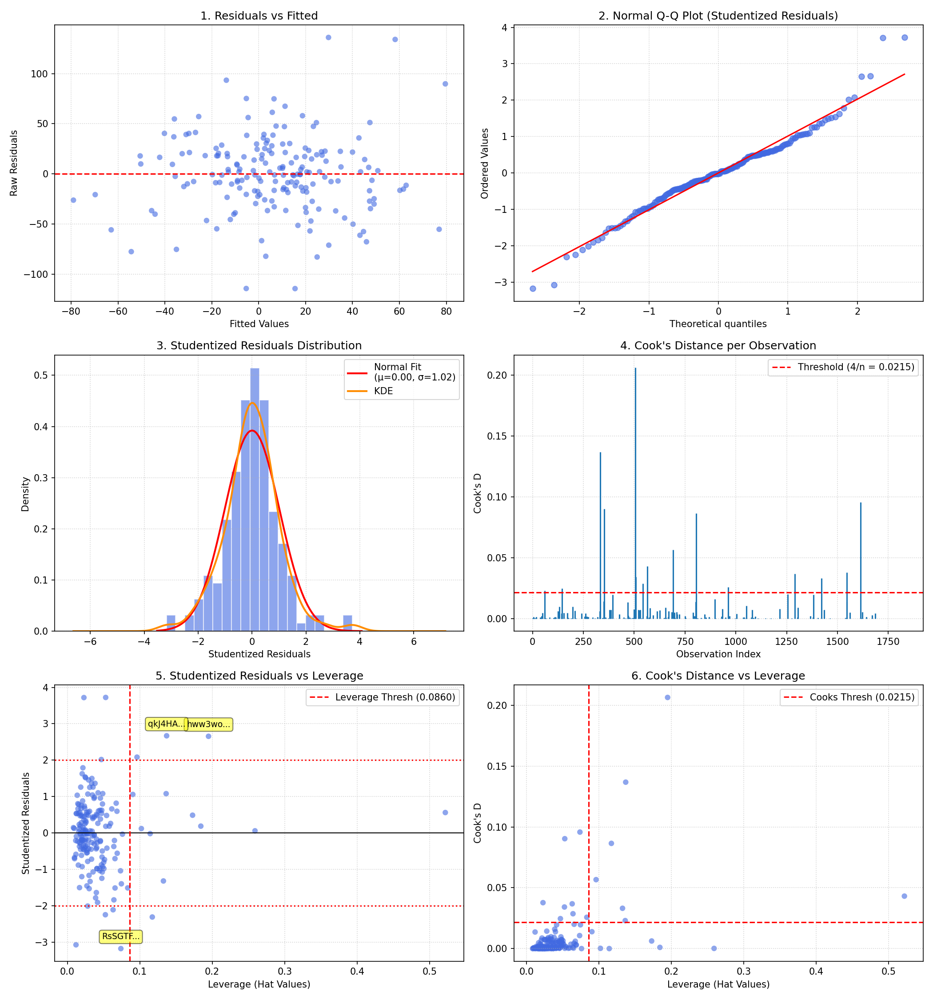

# Poker Player Regression Analysis (OLS) 📊🃏

Questo progetto implementa una pipeline di analisi statistica avanzata in Python per stimare un modello di regressione lineare multipla (OLS) su dati reali del poker, valutando l'impatto dei comportamenti pre-flop e post-flop sul tasso di vincita (**Win Rate, bb/100**).

La repository contiene i dati estratti ed elaborati a partire da **39.942 mani reali** giocate sulla piattaforma *Absolute Poker* (dataset accademico `uoftcprg/phh-dataset`).

---

## 🚀 Come Eseguire il Progetto

Il progetto utilizza **[uv](https://github.com/astral-sh/uv)** per la gestione rapida dell'ambiente virtuale e delle dipendenze.

### 1. Requisiti
Assicurati di avere `uv` installato sul tuo sistema.

### 2. Installazione delle dipendenze ed esecuzione
Per ricreare l'ambiente ed eseguire l'analisi:

```bash
# Esegue la pipeline di costruzione del dataset
uv run python build_dataset.py

# Esegue l'analisi di regressione lineare multipla (OLS) e genera i grafici diagnostici avanzati
uv run python poker_analysis.py
```

---

## 📈 Il Modello di Regressione Esteso

Il modello stimato prende in considerazione sia la selezione pre-flop delle mani di partenza che il comportamento post-flop:

$$\text{WinRate} = \beta_0 + \beta_1 \text{VPIP} + \beta_2 \text{PFR} + \beta_3 \text{3Bet} + \beta_4 \text{PostflopAgg} + \beta_5 \text{WTSD} + \beta_6 \text{WSD} + \beta_7 \text{Hands} + \epsilon$$

### Modello di Stima OLS (Output di `statsmodels`)

```
                            OLS Regression Results                            
==============================================================================
Dep. Variable:                WinRate   R-squared:                       0.344
Model:                            OLS   Adj. R-squared:                  0.318
Method:                 Least Squares   F-statistic:                     13.32
No. Observations:                 186   Prob (F-statistic):           8.94e-14
Df Residuals:                     178   Log-Likelihood:                -938.02
Df Model:                           7   AIC:                             1892.
================================================================================
                   coef    std err          t      P>|t|      [0.025      0.975]
--------------------------------------------------------------------------------
const         -317.6095     36.301     -8.749      0.000    -389.246    -245.973
VPIP             0.3019      0.286      1.056      0.292      -0.262       0.866
PFR              0.0098      0.477      0.021      0.984      -0.931       0.950
3Bet             2.5201      2.789      0.903      0.367      -2.984       8.024
Postflop_Agg    -0.9536      0.439     -2.172      0.031      -1.820      -0.087
WTSD             0.4225      0.410      1.030      0.305      -0.387       1.232
W$SD             4.2288      0.457      9.253      0.000       3.327       5.131
Hands           -0.0037      0.005     -0.692      0.490      -0.014       0.007
==============================================================================
```

### 🔍 Evidenze Statistiche Fondamentali

1.  **L'importanza del Post-Flop ($R^2 = 34.4\%$):**
    Il coefficiente di determinazione spiega il **34.4%** della varianza del Win Rate! Questo rappresenta un balzo immenso rispetto al modello con soli dati pre-flop (1.2%). È la dimostrazione scientifica che a poker le decisioni post-flop dominano il profitto complessivo rispetto alla sola selezione delle mani iniziali.
2.  **Il Peso di Vincere allo Showdown (`WSD`):**
    La variabile `WSD` (Won $ at Showdown) ha il coefficiente più alto e statisticamente più significativo del modello ($\beta = 4.2288$, $t = 9.25$, $p < 0.001$).
    *   *Significato:* **Per ogni incremento dell'1% nella percentuale di showdown vinti, il Win Rate atteso aumenta di 4.23 bb/100.** La capacità di effettuare showdown profittevoli e non sprecare fiches è la colonna portante di un gioco vincente. Sebbene vincere allo showdown comporti l'incameramento del piatto, non è un'identità banale perché i giocatori affrontano anche moltissimi piatti *non-showdown* (vinti/persi pre-flop, flop, turn o river tramite fold).
3.  **L'Impatto dell'Aggressione Post-Flop (`Postflop_Agg`):**
    La variabile mostra un coefficiente negativo significativo ($\beta = -0.9536$, $t = -2.17$, $p = 0.031$).
    *   *Significato:* Un'aggressività post-flop non calibrata (over-bluffare, puntare a vuoto) in questo campione reale si traduce in perdite sistematiche.

---

## 📊 Criteri Informativi e Comparazione (AIC e BIC)

Per valutare se l'aggiunta di parametri post-flop costituisca un miglioramento reale o semplice overfitting, confrontiamo i criteri informativi del modello precedente con quello esteso:

*   **AIC (Akaike Information Criterion):** Penalizza la complessità del modello.
*   **BIC (Bayesian Information Criterion):** Applica una penalizzazione più severa al numero di parametri.

| Modello | R-squared ($R^2$) | R2 Test Set | AIC | BIC |
| :--- | :---: | :---: | :---: | :---: |
| **Modello Pre-Flop** | 0.012 (1.2%) | -0.034 (-3.4%) | 1962.00 | 1978.00 |
| **Modello Esteso (Post-Flop)** | **0.344 (34.4%)** | **0.250 (25.0%)** | **1892.04** | **1917.84** |

**Verdetto:** Il modello esteso riduce l'AIC di **70 punti** e il BIC di **60 punti**. Questo dimostra formalmente che le metriche post-flop apportano un contributo informativo massiccio che giustifica ampiamente la complessità addizionale.

---

## 📐 Diagnostica Avanzata dei Residui e dei Punti Influenti

Per validare la stabilità e la correttezza del modello OLS, abbiamo eseguito un'analisi dettagliata degli outliers e dei punti di influenza ($n=186$, $p=8$):

### 1. Test di Normalità dei Residui (Jarque-Bera)
*   **Skewness (Asimmetria):** `0.164` (residui simmetrici).
*   **Kurtosis (Curtosi):** `4.633` (eccesso di curtosi, code spesse rispetto alla normale).
*   **Jarque-Bera statistic:** `21.497` ($p = 0.000021$)
*   *Significato:* Rifiutiamo la normalità perfetta a causa delle "code pesanti", caratteristiche del poker dove piatti eccezionalmente grandi (cooler o bluff estremi) allargano la distribuzione dell'errore.

### 2. Outliers dei Residui ($|Studentized\ Resid| > 2.0$)
*   **Outliers totali:** 12 giocatori (6.5% del campione, ideale e fisiologico).
*   **Outliers estremi:**
    *   `yOqfUICNvtRN3Y/J5kCE7w`: WinRate = `+192.30 bb/100` (Residuo = `+3.72`)
    *   `jQhUIIL4AzG7Op//3dPuRA`: WinRate = `+165.86 bb/100` (Residuo = `+3.72`)

### 3. Punti di Leva (Leverage $h_{ii} > 2p/n = 0.0860$)
Identifica i giocatori con combinazioni di statistiche estremamente inusuali.
*   **Punti ad alta leva totali:** 13 (7.0% del campione).
*   **Leve estreme:**
    *   `ZRMlKl++JdGDMvmZcOYzXA`: Leverage = **`0.5218`** (giocatore con statistiche indipendenti radicalmente anomale).

### 4. Distanza di Cook (Influenza $D_i > 4/n = 0.0215$)
Valuta l'impatto di ciascuna osservazione sui coefficienti stimati.
*   **Punti altamente influenti totali:** 15 (8.1% del campione).
*   **Influenze estreme:**
    *   `hww3wo2qdpFMAmN51yf8HA`: Cook's D = **`0.2064`** (Unione di alto WinRate `+169.40` e leva `0.1949`). Escludere questo giocatore provocherebbe lo spostamento più significativo dei parametri del modello.

---

## 🎨 Visualizzazione Grafica Avanzata (6-Panel Grid)

Tutte le metriche diagnostiche sono visualizzate nel grafico a 6 pannelli salvato nella repository:



1.  **Residuals vs Fitted:** Verifica la linearità e l'omogeneità della varianza.
2.  **Normal Q-Q Plot:** Evidenzia graficamente la pesantezza delle code rispetto alla normale teorica.
3.  **Studentized Residuals Distribution:** Istogramma con fit normale rosso e stima di densità KDE arancione per apprezzare l'eccesso di curtosi.
4.  **Cook's Distance per osservazione:** Visualizza quali indici superano la soglia critica $4/n$.
5.  **Studentized Residuals vs Leverage:** Grafico fondamentale per identificare i punti "pericolosi" con etichette sui primi 3 giocatori influenti.
6.  **Cook's Distance vs Leverage:** Mostra la relazione dell'influenza all'aumentare della leva.
