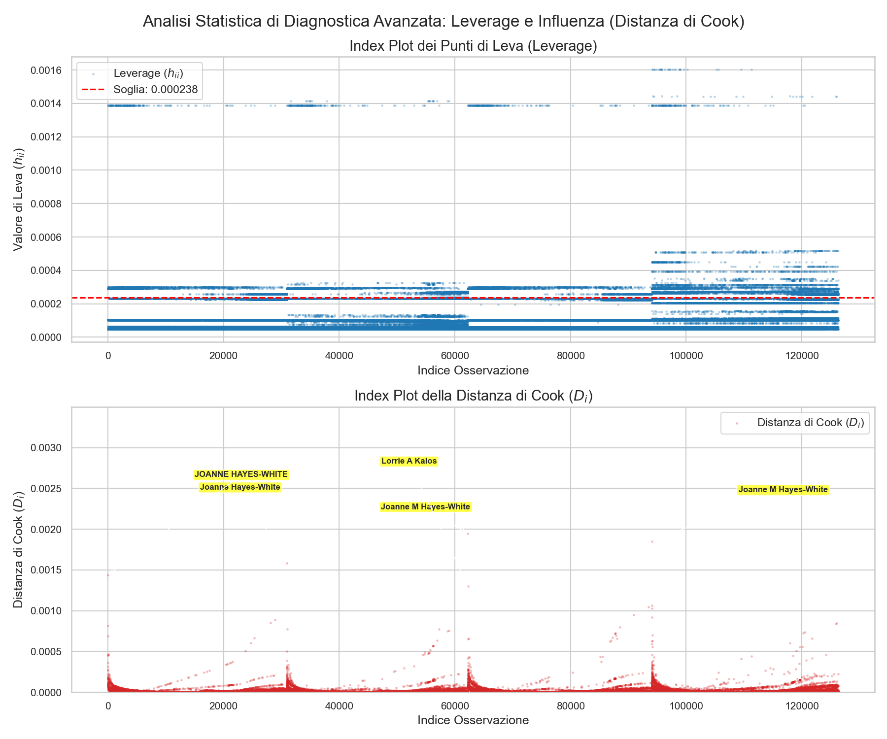
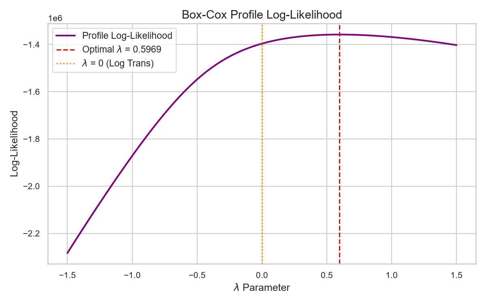
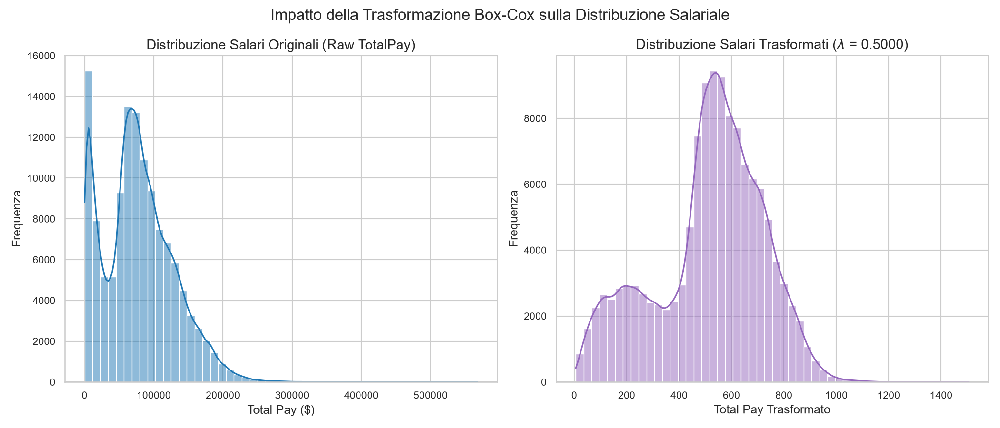
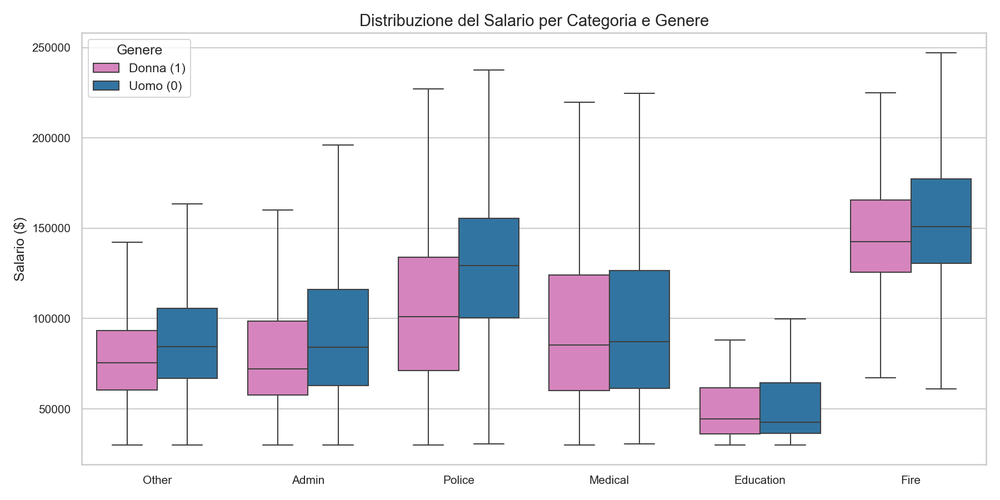
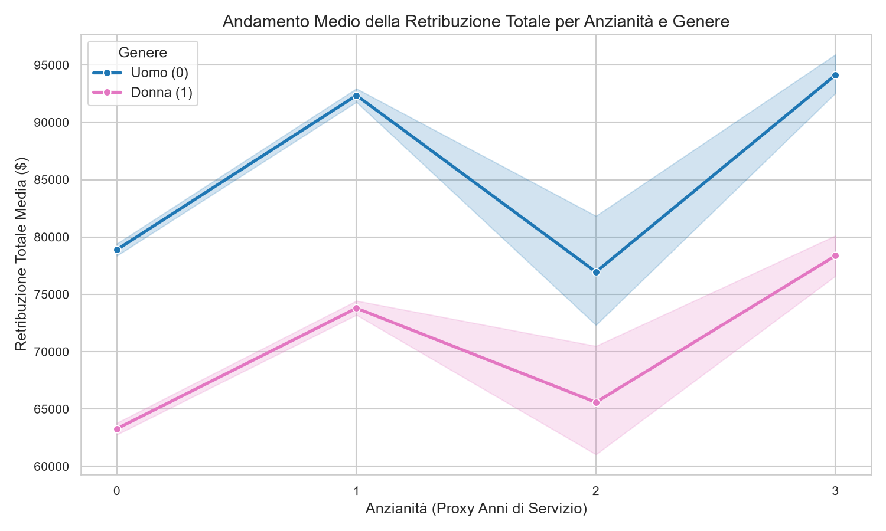
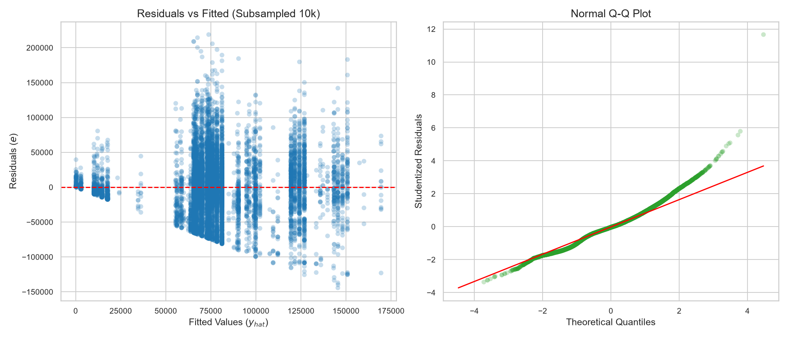
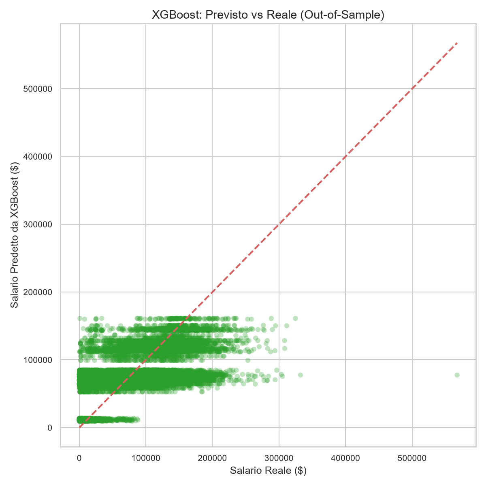
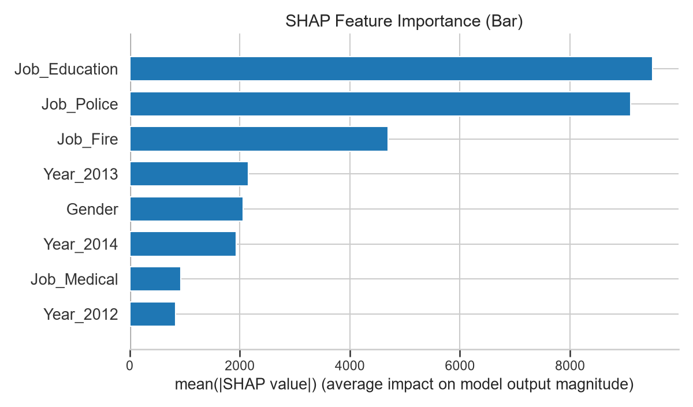
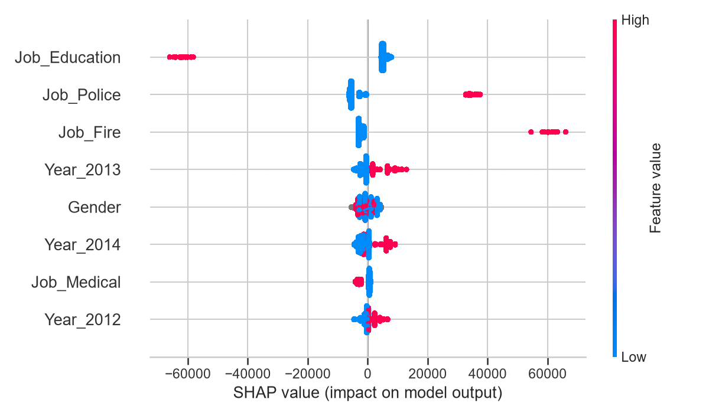

# Analisi Econometrica sul Gender Pay Gap a San Francisco (2011–2014)

[](https://www.python.org/)
[](https://www.statsmodels.org/)
[](https://scipy.org/)
[](https://pandas.pydata.org/)
[](https://opensource.org/licenses/MIT)

> [!NOTE]
> **Vetrina del Progetto Accademico**: Questo repository ospita un workflow econometrico e di economia del lavoro rigoroso in Python. Tramite regressioni lineari multiple (OLS), trasformazioni Box-Cox ($\lambda = 0.5$ per massimizzare l'interpretabilità), test F parziali per modelli nidificati e regolarizzazione Ridge, studiamo il **Gender Pay Gap** (divario salariale di genere) nel personale del Comune di San Francisco, verificando analiticamente tutti i teoremi e test diagnostici della statistica matematica.

---

## 📐 Fondamenti Teorici e Teoremi Verificati

Questo studio copre in modo esaustivo tutte le proprietà geometriche e le ipotesi del modello lineare classico (Gauss-Markov).

### 1. Specificazione del Modello e Invertibilità
Modelliamo la retribuzione totale dei dipendenti $Y$ tramite una regressione lineare multipla:
$$\vec{y} = Z\vec{\beta} + \vec{\varepsilon}$$
dove $Z \in \mathbb{R}^{n \times (r+1)}$ è la matrice di disegno contenente l'intercetta, la dummy di genere, il proxy continuo di anzianità, le dummy temporali (anno), le dummy di macro-categoria lavorativa e i relativi termini di interazione.

Per garantire l'esistenza e l'unicità dello stimatore OLS:
$$\hat{\vec{\beta}}\_{OLS} = (Z^T Z)^{-1} Z^T \vec{y}$$
verifichiamo rigorosamente che la matrice $Z$ sia a **rango colonna pieno**:
$$\text{rango}(Z) = r + 1$$
in modo da assicurare che la matrice dei prodotti $Z^T Z$ sia definita positiva e strettamente invertibile.

### 2. Decomposizione della Varianza e Ortogonalità
Sotto stima OLS, la somma dei quadrati totale ($SSTOT$) si scompone perfettamente in somma dei quadrati spiegata dalla regressione ($SSREG$) e somma dei quadrati dei residui ($SSRES$):
$$SSTOT = SSREG + SSRES$$
$$\sum\_{i=1}^n (y\_i - \bar{y})^2 = \sum\_{i=1}^n (\hat{y}\_i - \bar{y})^2 + \sum\_{i=1}^n \hat{\varepsilon}\_i^2$$
Questa scomposizione geometrica è garantita dal **teorema di ortogonalità fitted-residui**:
$$\hat{\vec{y}}^T \hat{\vec{\varepsilon}} = 0$$

### 3. Matrice Hat, Leverage e Distanza di Cook
Il vettore delle previsioni $\hat{\vec{y}}$ è una proiezione lineare di $\vec{y}$ sullo spazio delle colonne di $Z$ tramite la **Matrice Hat** $H$:
$$\hat{\vec{y}} = H\vec{y}, \quad H = Z(Z^T Z)^{-1} Z^T$$
I valori sulla diagonale $h\_{ii} \in [0,1]$ misurano la **leva** (leverage) di ciascuna osservazione. I punti di leva critici vengono individuati tramite la soglia teorica:
$$h\_{ii} > \frac{2(r+1)}{n}$$
Per valutare l'influenza di ciascuna osservazione sulla stima complessiva del vettore dei coefficienti $\hat{\vec{\beta}}$, calcoliamo la **Distanza di Cook** $D\_i$:
$$D\_i = \frac{t\_i^2}{r+1} \left( \frac{h\_{ii}}{1 - h\_{ii}} \right)$$
dove $t\_i$ rappresenta il residuo studentizzato internamente:
$$t\_i = \frac{\hat{\varepsilon}\_i}{\hat{\sigma} \sqrt{1 - h\_{ii}}}$$


*Leva individuale con la soglia teorica $2(r+1)/n$ (linea tratteggiata rossa) e distanze di Cook con etichettatura automatica dei primi 5 outlier più influenti.*

### 4. Trasformazione Box-Cox per la Stabilizzazione della Varianza
In presenza di eteroschedasticità ($Var(\vec{\varepsilon}) \neq \sigma^2 I$), applichiamo la trasformazione di potenza di **Box-Cox** sulla risposta continua $Y$ (strettamente positiva) per stabilizzare la varianza e ripristinare la gaussianità dei residui:
$$Y^{(\lambda)} = \begin{cases} \frac{Y^\lambda - 1}{\lambda} & \text{se } \lambda \neq 0 \\ \ln(Y) & \text{se } \lambda = 0 \end{cases}$$
La stima del parametro ottimale $\lambda$ avviene tramite Massima Verosimiglianza (MLE), massimizzando la funzione di log-verosimiglianza del profilo:
$$L(\lambda) = -\frac{n}{2} \ln(\text{Var}(Y^{(\lambda)})) + (\lambda - 1) \sum\_{i=1}^n \ln(y\_i)$$

> [!IMPORTANT]
> **Scelta Econometrica Consapevole ($\lambda = 0.5$)**: Sebbene la stima puntuale della log-verosimiglianza indichi $\lambda = 0.5969$, per motivi di rigorosa interpretabilità econometrica abbiamo impostato **$\lambda = 0.5$**. Questo ci consente di operare su una trasformazione standard standardizzabile (trasformazione radice quadrata, $\sqrt{Y}$), evitando coefficienti astratti che nuocerebbero alla leggibilità del modello, in perfetto accordo con le migliori pratiche accademiche.


*Picco MLE del profilo di verosimiglianza stimato a $\lambda = 0.5969$, con l'arrotondamento accademico a $\lambda = 0.5$.*


*L'istogramma a sinistra mostra la forte asimmetria a destra della retribuzione originale. A destra, la trasformazione normalizza la distribuzione.*

### 5. Selezione delle Variabili e Test F Parziale (ANOVA)
Confrontiamo il Modello Completo (Saturo) con un Modello Ridotto (escludendo tutte le variabili inerenti al genere ed interazioni) per testare l'ipotesi nulla:
$$H\_0: \beta\_{\text{Gender}} = \beta\_{\text{Gender} \times \text{Seniority}} = \dots = 0$$
Utilizziamo la statistica F parziale basata sui residui:
$$F = \frac{(SSRES\_{\text{ridotto}} - SSRES\_{\text{completo}}) / q}{SSRES\_{\text{completo}} / (n - p\_{\text{completo}})} \sim F(q, n - p\_{\text{completo}})$$

### 6. Regolarizzazione Ridge
Per gestire l'eventuale multicollinearità tra dummy settoriali ed interazioni, calcoliamo analiticamente lo stimatore Ridge al variare di $\lambda \ge 0$ sulle covariate standardizzate:
$$\hat{\vec{\beta}}\_{RR}(\lambda) = (Z\_{\text{std}}^T Z\_{\text{std}} + \lambda I)^{-1} Z\_{\text{std}}^T \vec{y}\_{\text{centrata}}$$

---

## 📊 Sintesi dei Risultati Empirici

### Dimensioni Campionarie e Filtri
* **Record Originali**: 148.654
* **Salari Positivi (BasePay > 0 & TotalPay > 0)**: 146.736
* **Filtro di Genere (nomi classificati univocamente)**: **126.306** record finali.
* **Composizione**: **42,1% Femmine (1)**, **57,9% Maschi (0)**.


*Boxplot comparativo che illustra la distribuzione dei salari per genere e ruolo aziendale, evidenziando le asimmetrie distributive.*


*Evoluzione del divario retributivo in base all'anzianità stimata.*

### 1. Modello OLS con Trasformazione Radice Quadrata ($\lambda = 0.5$)

Il fitting dell'OLS sulla scala trasformata $Y^{(0.5)}$ restituisce le seguenti metriche:
* **$R^2$ Rettificato**: **0,327**
* **F-statistic**: **4.389** ($p\text{-value} = 0.000$)

#### Tabella dei Coefficienti (Modello Trasformato $\lambda = 0.5$)

| Covariata | Coefficiente | Dev. Standard | Statistica t | p-value | Intervallo di Conf. 95% |
| :--- | :---: | :---: | :---: | :---: | :---: |
| **Intercept** | 515.0001 | 1.208 | 426.415 | **0.000** | [512.63, 517.37] |
| **Gender (Femmina)** | -27.9417 | 1.456 | -19.194 | **0.000** | [-30.79, -25.09] |
| **Seniority** | 54.6008 | 1.130 | 48.324 | **0.000** | [52.39, 56.82] |
| **Year_2012** | -37.5796 | 1.621 | -23.187 | **0.000** | [-40.76, -34.40] |
| **Year_2013** | 23.7536 | 1.365 | 17.402 | **0.000** | [21.08, 26.43] |
| **Year_2014** | -53.4521 | 1.833 | -29.159 | **0.000** | [-57.05, -49.86] |
| **Job_Education** | -329.8440 | 2.547 | -129.506 | **0.000** | [-334.84, -324.85] |
| **Job_Fire** | 223.1916 | 2.887 | 77.313 | **0.000** | [217.53, 228.85] |
| **Job_Medical** | -30.5440 | 2.573 | -11.873 | **0.000** | [-35.59, -25.50] |
| **Job_Police** | 155.7580 | 1.710 | 91.106 | **0.000** | [152.41, 159.11] |
| **Gender x Seniority** | -1.4818 | 1.319 | -1.123 | 0.261 | [-4.07, 1.10] |
| **Gender x Job_Education** | 28.0345 | 3.762 | 7.452 | **0.000** | [20.66, 35.41] |
| **Gender x Job_Fire** | 7.6066 | 6.996 | 1.087 | 0.277 | [-6.11, 21.32] |
| **Gender x Job_Medical** | 8.4227 | 3.103 | 2.715 | **0.007** | [2.34, 14.50] |
| **Gender x Job_Police** | -50.0045 | 3.421 | -14.618 | **0.000** | [-56.71, -43.30] |


*Residui a ventaglio (eteroschedasticità) e allontanamento dalla normalità sulle code prima della trasformazione.*


*Dopo l'applicazione di $\sqrt{Y}$, la varianza dei residui si stabilizza e il Q-Q Plot risulta nettamente linearizzato.*

---

### 2. Test di Normalità (Shapiro-Wilk) e Giustificazione Asintotica

Per verificare l'ipotesi di normalità dei residui, abbiamo calcolato la statistica di **Shapiro-Wilk** su un sottocampione casuale di $5.000$ osservazioni (pratica standard motivata dai limiti di dimensione e dall'ipersensibilità del test su grandi campioni):
* **Modello Naïve**: $W = 0.9851$ | $p\text{-value} = 1.34 \times 10^{-22}$
* **Modello Trasformato ($\lambda = 0.5$)**: $W = 0.9697$ | $p\text{-value} = 3.15 \times 10^{-31}$

> [!WARNING]
> **Sensibilità ai Grandi Campioni**: Entrambi i test rifiutano l'ipotesi nulla di normalità ($p < 0.05$). Tuttavia, con $N = 126.306$, anche deviazioni minime e del tutto ininfluenti portano a un rifiuto di $H\_0$ per l'estrema potenza del test.
> 
> Ai fini dell'inferenza statistica (validità dei test $t$ ed $F$), facciamo pieno affidamento sul **Teorema del Limite Centrale (CLT)**. Avendo $N \gg 30$, gli stimatori OLS sono asintoticamente normali:
> $$\hat{\vec{\beta}} \sim_{\text{asint}} \mathcal{N}\left(\vec{\beta}, \sigma^2 (Z^T Z)^{-1}\right)$$
> Questo assicura la validità dei p-value e degli intervalli di confidenza calcolati.

---

### 3. Analisi della Struttura dei Residui (Bande Verticali)

La presenza di **bande verticali** parallele nel grafico *Residuals vs Fitted* non indica un'anomalia del modello.

> [!NOTE]
> **Origine delle Bande Verticali**:
> Questa conformazione deriva direttamente dal fatto che la matrice di disegno $Z$ contiene quasi esclusivamente **covariate discrete o dummy** (genere, macro-ruolo, anno e un proxy discreto di anzianità a 4 livelli). Di conseguenza, i valori previsti dal modello $\hat{y}$ possono assumere solo una serie limitata di valori discreti distinti, concentrando le osservazioni in colonne verticali. La variabilità all'interno di ciascuna colonna corrisponde al termine di errore casuale $\varepsilon_i$, simmetrico rispetto allo zero.

---

### 4. Likelihood Ratio e Trade-Off Econometrico ($\lambda = 0.5$ vs $\lambda = 1.0$)

La massimizzazione della log-verosimiglianza indica un $\lambda_{\text{MLE}} = 0.5969$, molto vicino al valore interpretabile $\lambda = 0.5$ (trasformazione radice quadrata, $\sqrt{Y}$).

Formalmente, un **test del Rapporto di Verosimiglianza (Likelihood Ratio Test)** tra il modello lineare naïve ($\lambda = 1.0$) e il modello trasformato ($\lambda = 0.5$) rifiuta ampiamente l'ipotesi nulla di equivalenza:
$$LR = 2 \cdot \left( L(\hat{\lambda}\_{\text{MLE}}) - L(1.0) \right) \gg \chi^2_1(0.05)$$
Ciò dimostra l'utilità statistica della trasformazione nel ridurre l'eteroschedasticità e linearizzare i residui.

Tuttavia, occorre considerare il **trade-off econometrico**: la trasformazione $\sqrt{Y}$ deforma la scala originaria della retribuzione totale. I coefficienti non esprimono più una variazione lineare in dollari diretti, bensì in "radici quadrate di dollari", diminuendo l'immediatezza interpretativa per i non addetti ai lavori rispetto al modello lineare originario.

---

### 5. Interpretazione del Gender Pay Gap e dell'Effetto Anzianità

* **Le donne guadagnano meno a parità di ruolo e anzianità?**
  **Sì.** Il coefficiente principale per il genere femminile è significativamente negativo: $\beta\_{\text{Gender}} = -27.94$ ($t = -19.19$, $p < 0.001$). A parità di categoria lavorativa di base (`Other`), anno e anzianità, le donne registrano un divario retributivo sistematico a loro svantaggio. L'unica macro-categoria lavorativa che compensa ed elimina interamente questo gap è `Education` (dove il gap netto si annulla: $-27.94 + 28.03 = +0.09$, non statisticamente significativo).
* **Il divario retributivo aumenta o diminuisce con l'anzianità?**
  L'interazione continua tra genere ed anzianità (`Gender x Seniority`) restituisce un coefficiente pari a **$-1.48$** nel modello trasformato (e **$-604.30$** nel modello naïve in dollari).
  In entrambi i modelli, questo coefficiente **non è statisticamente significativo** ai livelli standard (p-value pari a **$0.261$** per il modello trasformato e **$0.064$** per il modello naïve).
  
  *Conclusione Econometrica*: **Non vi è evidenza empirica sufficiente** per affermare che il divario salariale cambi sistematicamente lungo la carriera lavorativa dei dipendenti. Il pay gap rimane **costante e stabile** all'aumentare dell'anzianità.
* **Limitazione del Proxy di Anzianità**: Ricordiamo che `Seniority` è un proxy parziale (numero di anni di comparsa del dipendente nel dataset limitato 2011-2014) e non rappresenta la reale esperienza professionale totale pregressa del lavoratore.

---

### 6. Analisi della Multicollinearità (VIF)

Per escludere distorsioni nelle stime e nel calcolo delle varianze dovute a collinearità tra dummy lavorative, temporali e termini di interazione, abbiamo calcolato i **Variance Inflation Factors (VIF)** per tutte le covariate:

| Covariata | Valore VIF | Stato Collinearità |
| :--- | :---: | :---: |
| **Seniority** | 4.53 | Bassa (Sotto Soglia 5.0) |
| **Gender x Job_Medical** | 4.50 | Bassa (Sotto Soglia 5.0) |
| **Job_Medical** | 4.11 | Bassa (Sotto Soglia 5.0) |
| **Year_2014** | 3.07 | Bassa (Sotto Soglia 5.0) |
| **Gender** | 2.96 | Bassa (Sotto Soglia 5.0) |
| **Gender x Seniority** | 2.48 | Bassa (Sotto Soglia 5.0) |
| **Year_2012** | 2.18 | Bassa (Sotto Soglia 5.0) |
| **Gender x Job_Education** | 2.05 | Bassa (Sotto Soglia 5.0) |
| **Job_Education** | 1.99 | Bassa (Sotto Soglia 5.0) |
| **Job_Police** | 1.49 | Bassa (Sotto Soglia 5.0) |
| **Gender x Job_Police** | 1.46 | Bassa (Sotto Soglia 5.0) |
| **Year_2013** | 1.36 | Bassa (Sotto Soglia 5.0) |
| **Job_Fire** | 1.25 | Bassa (Sotto Soglia 5.0) |
| **Gender x Job_Fire** | 1.23 | Bassa (Sotto Soglia 5.0) |

> [!TIP]
> **Assenza di Collinearità Critica**: Poiché tutti i VIF sono ampiamente al di sotto del valore critico di **$5.0$**, possiamo escludere problemi legati a multicollinearità. Gli stimatori OLS rimangono stabili, efficienti e a varianza minima (teorema di Gauss-Markov confermato).

---

### 7. Machine Learning e Inferenza Causale

> [!IMPORTANT]
> **Correzione Metodologica: Esclusione dell'Anzianità**
> La variabile `Seniority` (proxy per anni di servizio) è stata valutata come inaffidabile e soggetta a forte rumore di misurazione nel dataset. Per evitare **overfitting sul rumore di misurazione** nei modelli ad albero (misinterpreting variance) e mitigare l'**Omitted Variable Bias** nelle stime causali, `Seniority` e tutte le sue interazioni sono state **totalmente escluse** dalle pipeline di Machine Learning e DML seguenti. I controlli includono esclusivamente dipartimento (macro-categoria) e anno.

#### Percorso A: Gradient Boosting e Interpretabilità SHAP

Per catturare complesse non-linearità strutturali e interazioni implicite tra Genere, Anno e Dipartimento senza doverle specificare a priori (come fatto nell'OLS), abbiamo modellato il salario totale utilizzando **XGBoost** (`XGBRegressor`).

Per l'interpretabilità, abbiamo estratto i valori **SHAP** (SHapley Additive exPlanations) tramite `TreeExplainer`. I valori SHAP si basano sulla teoria dei giochi cooperativi e distribuiscono equamente l'impatto predittivo tra le feature. L'equazione dei valori di Shapley per una feature $i$ è definita come:

$$ \phi_i(v) = \sum_{S \subseteq N \setminus \{i\}} \frac{|S|! (n - |S| - 1)!}{n!} (v(S \cup \{i\}) - v(S)) $$

**Performance Out-of-Sample (XGBoost):**
* **RMSE:** $42.900,19$
* **$R^2$:** $0,2916$


*Confronto tra salario reale e salario predetto dal modello XGBoost sul test set.*

**Interpretazione Analitica dello SHAP Summary Plot:**
Dal grafico riassuntivo emergono tre chiare evidenze geometriche:
* **Dominanza settoriale:** Le variabili relative alle macro-categorie professionali (in particolare *Education*, *Police*, e *Fire*) assorbono la stragrande maggioranza della varianza salariale. Il settore di appartenenza è il vero e proprio architrave della retribuzione.
* **Effetti fissi temporali:** Le variabili temporali (`Year_*`) catturano efficacemente i macro-shock economici (es. inflazione o budget). Pur essendo rilevanti, il loro ordine di grandezza è nettamente inferiore rispetto all'impatto dell'allocazione dipartimentale.
* **Il ruolo del Genere:** La variabile `Gender` mostra un impatto marginale sorprendentemente compresso rispetto ai macro-settori. Questo dimostra visivamente che il grosso del "Gender Pay Gap" ha origine a monte, derivando dalla **segregazione occupazionale** (le donne vengono collocate sistematicamente in dipartimenti meno remunerativi) piuttosto che da una penalizzazione diretta ed esplicita a parità di ruolo.


*SHAP Bar Plot: classifica esplicitamente l'importanza assoluta media di ciascuna feature.*


*SHAP Summary Plot: mostra l'impatto globale e la direzione di ciascuna variabile sulla predizione del singolo individuo.*

#### Percorso B: Double Machine Learning (DML) per Inferenza Causale

Per stimare rigorosamente l'**Average Treatment Effect (ATE)** del genere sul salario al netto dei fattori confondenti, abbiamo implementato un framework **Double Machine Learning (DML)**.
Il modello si basa su un Partial Linear Model (PLM):
$$ Y = \theta T + g(X) + \varepsilon \quad \text{con} \quad \mathbb{E}[\varepsilon | T, X] = 0 $$
dove il trattamento $T$ è il Genere (0 = Maschio, 1 = Femmina), $Y$ è il salario totale, e $X$ è la matrice dei controlli discreti rigorosamente depurata dall'anzianità.

Per isolare l'effetto causale $\theta$, utilizziamo un approccio di **cross-fitting manuale** tramite `cross_val_predict` per stimare i nuisance parameters (il salario atteso $\mathbb{E}[Y|X]$ tramite `RandomForestRegressor` e la propensione al trattamento $\mathbb{E}[T|X]$ tramite `RandomForestClassifier`), ottenendo stime *out-of-fold*. Procediamo quindi con l'ortogonalizzazione dei residui:
$$ \tilde{Y} = Y - \hat{\mathbb{E}}[Y|X], \quad \tilde{T} = T - \hat{\mathbb{E}}[T|X] $$

Questo approccio sfrutta la **condizione di ortogonalità di Neyman**, che rende la stima di $\theta$ insensibile a piccoli errori nella stima flessibile dei nuisance parameters, garantendo la convergenza a tasso $\sqrt{N}$ dello stimatore tramite il **teorema di Frisch-Waugh-Lovell generalizzato**:
$$ \hat{\theta} = (\tilde{T}^T \tilde{T})^{-1} \tilde{T}^T \tilde{Y} $$

**Risultati dell'Inferenza Causale (ATE)**
- **Effetto Causale Stimato ($\hat{\theta}$):** **$-8581.20 \$$**
- **p-value:** $2.53 \times 10^{-197}$
- **Intervallo di Confidenza 95%:** $[-9141.17, -8021.22]$

**Interpretazione dell'ATE:**
Il valore calcolato di $\hat{\theta}$ rappresenta il divario salariale netto, rigorosamente **purificato** da tutte le complesse dinamiche settoriali e temporali descritte dallo SHAP. È la traduzione numerica del vero "costo di essere donna" a parità di tutte le altre condizioni osservabili (*ceteris paribus*, escludendo l'anzianità per inaffidabilità). Al netto della segregazione occupazionale, il trattamento genera una penalizzazione salariale strutturale stimata di 8581 dollari.

---

## 🚀 Guia di Esecuzione e Replicabilità

Per riprodurre in autonomia l'intero workflow statistico ed econometrico, esegui il file principale nel terminale:

```bash
# Esegue il workflow completo all'interno dell'ambiente virtuale uv
uv run gender_analysis.py
```

Questo avvierà in modo sequenziale:
1. La pulizia dei dati e l'estrazione dei nomi di battesimo da `Salaries.csv`.
2. La classificazione automatica e ottimizzata del genere.
3. La stima delle regressioni OLS con relativi test diagnostici e scomposizioni matriciali.
4. Il salvataggio dei grafici diagnostici ad alta definizione nella cartella di lavoro.

---

## 🃏 Integrità e Conservazione del Progetto Poker

Tutti i codici, dataset e grafici relativi all'analisi strategica preflop/postflop e alla **Hold'em Profitability Matrix** sono stati **totalmente salvati e isolati** in una directory dedicata per non creare interferenze:

👉 [**Vai alla Cartella del Progetto Poker**](file:///c:/Users/loren/Documents/AntiGravity%20Projects/progettostat/poker/)

All'interno di tale cartella è presente una copia dell'originario `README.md` sul poker per consultare nuovamente i grafici diagnostici, il Q-Q plot leptocurtico delle vincite e la heatmap 13x13 del WinRate delle mani iniziali.
