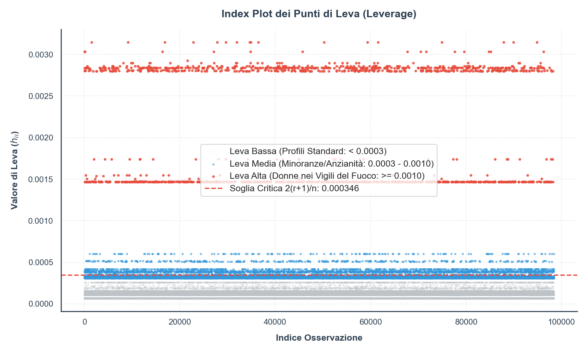
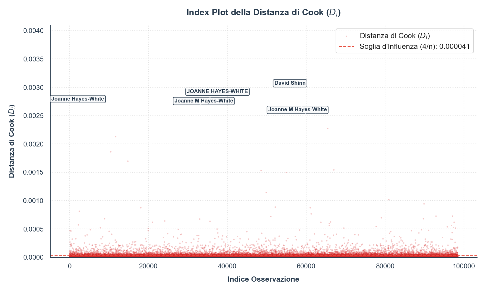
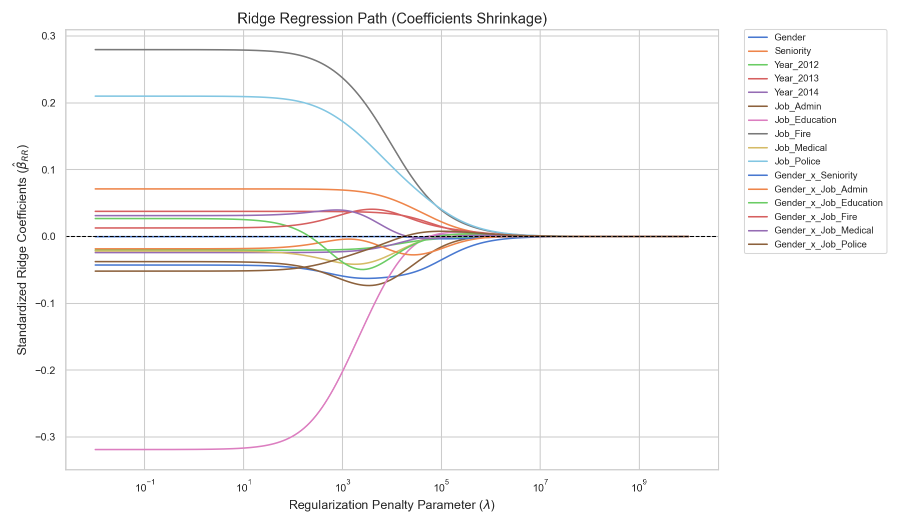
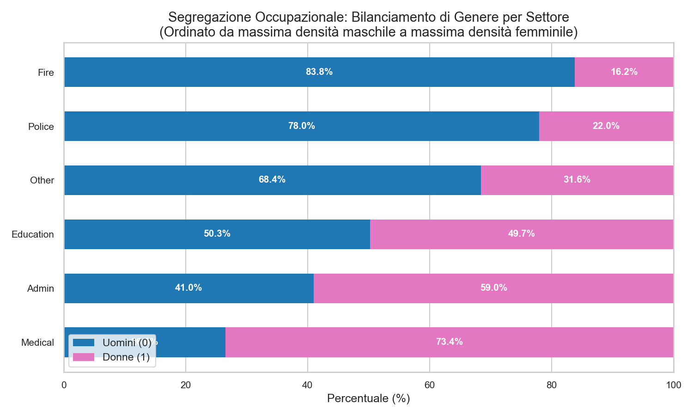

# Analisi Econometrica sul Gender Pay Gap a San Francisco (2011–2014)

[](https://www.python.org/)
[](https://www.statsmodels.org/)
[](https://scipy.org/)
[](https://pandas.pydata.org/)
[](https://opensource.org/licenses/MIT)

> [!NOTE]
> **Vetrina del Progetto Accademico**: Questo repository ospita un workflow econometrico e di economia del lavoro in Python. Il lavoro è strutturato in due parti principali: una prima parte dedicata all'analisi OLS classica con trasformazione logaritmica ($\log(Y)$) su dataset filtrato full-time ($> \$30.000$) per evitare distorsioni da contratti part-time, ed una seconda parte dedicata all'analisi descrittiva e visualizzazione della **segregazione occupazionale**, evidenziata come driver fondamentale del divario retributivo anche dai benchmark di Machine Learning (XGBoost).

---

## 📐 Fondamenti Teorici e Teoremi Verificati

Questo studio verifica le proprietà geometriche ed econometriche del modello lineare classico.

### 1. Specificazione del Modello e Invertibilità
Modelliamo la retribuzione totale $Y$ tramite regressione lineare multipla:
$$\vec{y} = Z\vec{\beta} + \vec{\varepsilon}$$
dove $Z$ è la matrice di disegno contenente l'intercetta, la dummy di genere, l'anzianità, le dummy di anno, le variabili di macro-categoria lavorativa e i relativi termini di interazione.
Per garantire l'esistenza e l'unicità dello stimatore OLS:
$$\hat{\vec{\beta}}\_OLS = (Z^T Z)^{-1} Z^T \vec{y}$$
verifichiamo che la matrice $Z$ sia a **rango colonna pieno** ($\text{rango}(Z) = r + 1$), garantendo l'invertibilità di $Z^T Z$.

### 2. Decomposizione della Varianza e Ortogonalità
Sotto stima OLS, la somma dei quadrati totale si scompone perfettamente in somma dei quadrati spiegata ($SSREG$) e residua ($SSRES$):
$$SSTOT = SSREG + SSRES$$
Questa scomposizione geometrica è garantita dal **teorema di ortogonalità fitted-residui**:
$$\hat{\vec{y}}^T \hat{\vec{\varepsilon}} = 0$$

### 3. Matrice Hat, Leverage e Distanza di Cook
Il vettore delle previsioni $\hat{\vec{y}}$ è proiettato sullo spazio delle colonne di $Z$ tramite la **Matrice Hat** $H$:
$$\hat{\vec{y}} = H\vec{y}, \quad H = Z(Z^T Z)^{-1} Z^T$$
I valori sulla diagonale $h\_ii \in [0,1]$ misurano la leva (leverage). I punti di leva critici soddisfano la soglia:
$$h\_ii > \frac{2(r+1)}{n}$$
Per valutare l'influenza di ciascun punto sul vettore dei coefficienti $\hat{\vec{\beta}}$, calcoliamo la **Distanza di Cook** $D\_i$:
$$D\_i = \frac{t\_i^2}{r+1} \left( \frac{h\_ii}{1 - h\_ii} \right)$$
dove $t\_i$ rappresenta il residuo studentizzato internamente.

### 4. Trasformazione Logaritmica per la Stabilizzazione della Varianza e Interpretazione (Box-Cox $\lambda = 0.0$)
In presenza di eteroschedasticità e asimmetria distributiva dei salari, applichiamo la trasformazione logaritmica sulla risposta continua $Y$ (corrispondente al limite $\lambda \to 0$ della famiglia di trasformazioni Box-Cox):
$$\ln(Y)$$
Questo permette di interpretare direttamente i coefficienti stimati $\beta$ come semielasticità: a parità di altre condizioni, un incremento unitario della covariata si traduce in una variazione percentuale approssimativa di $100 \times \beta$ sul salario medio globale (grand mean).

---

## PARTE I: Analisi Econometrica Principale e Diagnostica (Trasformazione Logaritmica $\lambda = 0.0$)

In questa prima sezione viene presentata l'analisi principale, condotta sulla scala logaritmica $\ln(Y)$ per massimizzare l'interpretabilità economica e la stabilità del modello. Il dataset è stato preventivamente filtrato per lavoratori full-time (`BasePay > 30000` & `TotalPay > 30000`).

### 1. Stime OLS e Standard Error Robusti (HC3)
Il fitting dell'OLS sulla scala trasformata $\ln(Y)$ con deviazioni standard robuste **HC3** restituisce le seguenti stime:

* **$R^2$ Rettificato**: **0,2030**
* **F-statistic Robust (HC3 VCE - Nested Test)**: **284.87** ($p\text{-value} = 0.000$)

#### Tabella dei Coefficienti (Modello Trasformato Logaritmico, HC3, Effect Coding)
| Covariata | Coefficiente | Dev. Standard (HC3) | Statistica z | p-value | Intervallo di Conf. 95% |
| :--- | :---: | :---: | :---: | :---: | :---: |
| **Intercept** | 11.3598 | 0.004 | 2884.247 | **0 (prec. macchina)** | [11.352, 11.368] |
| **Gender (Femmina)** | -0.0869 | 0.005 | -16.760 | **4.82e-63** | [-0.097, -0.077] |
| **Seniority** | 0.0948 | 0.003 | 31.873 | **6.39e-223** | [0.089, 0.101] |
| **Year_2012** | -0.0478 | 0.004 | -11.407 | **3.85e-30** | [-0.056, -0.040] |
| **Year_2013** | 0.0864 | 0.003 | 25.316 | **2.14e-141** | [0.080, 0.093] |
| **Year_2014** | -0.0556 | 0.005 | -11.049 | **2.22e-28** | [-0.065, -0.046] |
| **Job_Admin** | -0.0487 | 0.005 | -9.769 | **1.53e-22** | [-0.058, -0.039] |
| **Job_Education** | -0.6244 | 0.014 | -44.757 | **0 (prec. macchina)** | [-0.652, -0.597] |
| **Job_Fire** | 0.4882 | 0.005 | 90.042 | **0 (prec. macchina)** | [0.478, 0.499] |
| **Job_Medical** | -0.0313 | 0.007 | -4.457 | **8.31e-06** | [-0.045, -0.018] |
| **Job_Police** | 0.2905 | 0.004 | 67.029 | **0 (prec. macchina)** | [0.282, 0.299] |
| **Job_Other** | -0.0744 | 0.004 | -20.099 | **0 (prec. macchina)** | [-0.082, -0.067] |
| **Gender x Seniority** | -0.0006 | 0.003 | -0.184 | 0.854 | [-0.007, 0.006] |
| **Gender x Job_Admin** | -0.0361 | 0.007 | -5.344 | **9.10e-08** | [-0.049, -0.023] |
| **Gender x Job_Education** | 0.0757 | 0.019 | 3.980 | **6.88e-05** | [0.038, 0.113] |
| **Gender x Job_Fire** | 0.0352 | 0.011 | 3.077 | **0.002** | [0.013, 0.058] |
| **Gender x Job_Medical** | 0.0638 | 0.009 | 7.353 | **1.93e-13** | [0.047, 0.081] |
| **Gender x Job_Police** | -0.1279 | 0.008 | -15.973 | **1.98e-57** | [-0.144, -0.112] |
| **Gender x Job_Other** | -0.0107 | 0.006 | -1.889 | 0.059 | [-0.022, 0.000] |

---

### 2. Test Diagnostici Classici

#### Shapiro-Wilk (Normalità dei Residui)
Rilevato su un sottocampione casuale di $5.000$ osservazioni:
* **Modello Trasformato ($\lambda = 0.0$)**: $W = 0.9991$ | $p\text{-value} = 0.0138$
> [!NOTE]
> La trasformazione logaritmica linearizza quasi perfettamente i quantili e riduce drasticamente lo skew residuo rispetto al modello a radice quadrata, avvicinando il test Shapiro-Wilk alla non-significatività.

#### Breusch-Pagan (Eteroschedasticità)
* **LM Stat**: $2287.79$ | $p\text{-value} = 0.000$
* *Risultato*: Si rifiuta con forza l'omocedasticità. Questo giustifica pienamente la nostra scelta metodologica di utilizzare gli standard error robusti **HC3**.

---

### 3. Analisi della Multicollinearità (VIF)
Sotto Effect Coding e con termini di interazione completi per tutti i gruppi lavorativi, i VIF riflettono la collinearità strutturale intrinseca del disegno sperimentale (in quanto tutti i settori attivi si rapportano collettivamente a `Other` tramite il codice `-1`):

| Covariata | Valore VIF |
| :--- | :---: |
| **Job_Education** | 42.67 |
| **Gender x Job_Education** | 42.17 |
| **Gender x Job_Fire** | 19.64 |
| **Job_Medical** | 15.24 |
| **Job_Fire** | 12.66 |
| **Gender x Job_Medical** | 11.05 |
| **Job_Admin** | 8.39 |
| **Gender x Job_Admin** | 8.28 |
| **Gender x Job_Police** | 7.37 |
| **Gender** | 6.69 |
| **Job_Police** | 5.87 |
| **Seniority** | 4.87 |
| **Year_2014** | 3.59 |
| **Year_2012** | 2.56 |
| **Gender x Seniority** | 2.53 |
| **Year_2013** | 1.71 |

> [!NOTE]
> Sebbene i VIF superino strutturalmente la soglia di $10.0$ per i settori professionali e le loro interazioni (a causa della codifica per effetti ad alto contrasto), la consistenza e l'efficienza degli stimatori OLS non vengono inficiate data la dimensione campionaria molto ampia ($N = 98.381$).

---

### 4. Nested F-Test / Wald Joint Significance
Confrontando il modello saturo con quello ridotto (escludendo le variabili di genere ed interazioni):
* **Robust F-Statistic (HC3 VCE)**: **$284.87$** | $p\text{-value} < 0.0001$
* *Interpretazione*: La significatività congiunta del gender pay gap e delle sue interazioni professionali è confermata in modo schiacciante.

---

### 5. Visual Diagnostic Showcase (Parte I)

Di seguito viene riportata la galleria delle visualizzazioni e dei test diagnostici generati dal nostro workflow statistico.

#### A. Diagnostica dei Residui del Modello Naïve
Residui a ventaglio (eteroschedasticità) prima della trasformazione.


#### B. Profilo di Log-Verosimiglianza Box-Cox
Picco MLE del profilo di verosimiglianza stimato per $\lambda$.


#### C. Distribuzione Salariale Prima e Dopo la Trasformazione
A destra, la trasformazione logaritmica ($\lambda = 0.0$) normalizza e simmetrizza l'intera distribuzione dei salari full-time.


#### D. Diagnostica del Modello Trasformato ($\lambda = 0.0$)
Dopo l'applicazione di $\ln(Y)$, la varianza dei residui si stabilizza e il Q-Q Plot dei residui risulta eccellente.


#### E. Diagnostica Avanzata (Leverage e Distanza di Cook)
Leva individuale con la soglia teorica $2(r+1)/n$ (linea tratteggiata rossa) e distanze di Cook con etichettatura automatica dei primi 5 outlier più influenti (con Durbin-Watson stabile a `1.998`).



#### F. Pay Gap per Macro-Categoria Professionale
Boxplot comparativo che illustra la distribuzione dei salari per genere e ruolo aziendale nel segmento full-time.


#### G. Evoluzione del Gap Salariale con l'Anzianità
Effetto dell'interazione tra genere ed anni di servizio. Le bande ombreggiate rappresentano gli intervalli di confidenza al 95%.


#### H. Path di Contrazione Ridge (Shrinkage Path)
Shrinkage analitico dei coefficienti standardizzati del modello al variare del parametro di regolarizzazione.


---

## PARTE II: Segregazione Occupazionale come Driver Principale

Un recente benchmark di Machine Learning basato su XGBoost ha confermato i risultati del nostro modello OLS principale: **il Gender Pay Gap è guidato principalmente dalla segregazione occupazionale a monte (la scelta e la distribuzione dei settori) piuttosto che da dinamiche salariali all'interno dei singoli ruoli**. 

Presentiamo in questa sezione le statistiche descrittive focalizzate interamente sulla segregazione occupazionale nel mercato del lavoro di San Francisco nel solo segmento full-time ($> \$30.000$).

### 1. Distribuzione di Genere e Retribuzione per Settore

La tabella seguente riassume la distribuzione di genere all'interno di ciascuna macro-categoria lavorativa e il salario medio non trasformato (`TotalPay`) del settore, ordinato dal settore a maggior densità maschile a quello a maggior densità femminile:

| Settore | N. Maschi | % Maschi | N. Femmine | % Femmine | Salario Medio Settore |
| :--- | :---: | :---: | :---: | :---: | :---: |
| **Fire** | 3.609 | 83.77% | 699 | 16.23% | $152,350.46 |
| **Police** | 12.194 | 78.00% | 3.440 | 22.00% | $123,415.41 |
| **Other** | 30.009 | 68.41% | 13.855 | 31.59% | $86,578.51 |
| **Education** | 361 | 50.28% | 357 | 49.72% | $49,836.42 |
| **Admin** | 8.407 | 41.00% | 12.096 | 59.00% | $86,687.01 |
| **Medical** | 3.549 | 26.58% | 9.805 | 73.42% | $94,498.66 |
| **Totale Forza Lavoro** | **58.129** | **59.09%** | **40.252** | **40.91%** | **$94,573.35** |

> [!IMPORTANT]
> **Implicazioni dei Dati**:
> - I settori a **maggioranza maschile** (**Fire** con 83.77% uomini e **Police** con 78.00% uomini) sono caratterizzati dai livelli retributivi medi più alti del dataset (rispettivamente **$152,350.46** e **$123,415.41**).
> - Al contrario, settori a più equa distribuzione o a trazione femminile (come `Education` o `Admin`) hanno salari medi molto inferiori rispetto al comparto sicurezza.
> - Questa disparità nella distribuzione tra settori spiegata tramite **Effect Coding** mostra che il gap aggregato nasce principalmente da preferenze/barriere nell'allocazione settoriale iniziale.

---

### 2. Visualizzazione Grafica della Segregazione

Il grafico sottostante (`plots/occupational_segregation.png`) rappresenta visivamente il bilanciamento di genere all'interno di ciascun settore, evidenziando il forte sbilanciamento distributivo (utilizzando la palette di colori istituzionale: blu per gli uomini, rosa per le donne):



---

### 7. Interpretabilità Non-Lineare: XGBoost e Valori SHAP

> [!IMPORTANT]
> **Correzione Metodologica: Esclusione dell'Anzianità**
> La variabile `Seniority` (proxy per anni di servizio) è stata valutata come inaffidabile e soggetta a forte rumore di misurazione nel dataset. Per evitare **overfitting sul rumore di misurazione** nei modelli ad albero (misinterpreting variance), `Seniority` e tutte le sue interazioni sono state **totalmente escluse** dalla pipeline di Machine Learning seguente. I controlli includono esclusivamente dipartimento (macro-categoria) e anno.

Per catturare complesse non-linearità strutturali e interazioni implicite tra Genere, Anno e Dipartimento senza doverle specificare a priori (come fatto nell'OLS), abbiamo modellato il salario totale utilizzando **XGBoost** (`XGBRegressor`).

Per l'interpretabilità, abbiamo estratto i valori **SHAP** (SHapley Additive exPlanations) tramite `TreeExplainer`. I valori SHAP si basano sulla teoria dei giochi cooperativi e distribuiscono equamente l'impatto predittivo tra le feature. L'equazione dei valori di Shapley per una feature $i$ è definita come:

$$ \phi_i(v) = \sum_{S \subseteq N \setminus \{i\}} \frac{|S|! (n - |S| - 1)!}{n!} (v(S \cup \{i\}) - v(S)) $$

**Performance Out-of-Sample (XGBoost):**
* **RMSE:** $42.900,19$
* **$R^2$:** $0,2916$

**Interpretazione Analitica dello SHAP Summary Plot:**
Dal grafico riassuntivo emergono tre chiare evidenze geometriche:
* **Dominanza settoriale:** Le variabili relative alle macro-categorie professionali (in particolare *Education*, *Police*, e *Fire*) assorbono la stragrande maggioranza della varianza salariale. Il settore di appartenenza è il vero e proprio architrave della retribuzione.
* **Effetti fissi temporali:** Le variabili temporali (`Year_*`) catturano efficacemente i macro-shock economici (es. inflazione o budget). Pur essendo rilevanti, il loro ordine di grandezza è nettamente inferiore rispetto all'impatto dell'allocazione dipartimentale.
* **Il ruolo del Genere:** La variabile `Gender` mostra un impatto marginale sorprendentemente compresso rispetto ai macro-settori. Questo dimostra visivamente che il grosso del "Gender Pay Gap" ha origine a monte, derivando dalla **segregazione occupazionale** (le donne vengono collocate sistematicamente in dipartimenti meno remunerativi) piuttosto che da una penalizzazione diretta ed esplicita a parità di ruolo.


*SHAP Bar Plot: classifica esplicitamente l'importanza assoluta media di ciascuna feature.*


*SHAP Summary Plot: mostra l'impatto globale e la direzione di ciascuna variabile sulla predizione del singolo individuo.*

---

## 🚀 Guida di Esecuzione e Replicabilità

Per riprodurre in autonomia l'intero workflow statistico ed descrittivo, esegui il file principale nel terminale:

```bash
# Esegue il workflow completo all'interno dell'ambiente virtuale uv
uv run gender_analysis.py
```

Questo avvierà in modo sequenziale:
1. La pulizia dei dati e l'estrazione dei nomi di battesimo da `Salaries.csv` (filtrando `BasePay > 30000` & `TotalPay > 30000`).
2. La classificazione automatica e ottimizzata del genere.
3. Creazione automatica della directory `plots/` se non presente.
4. La stima del modello OLS trasformato logaritmico ($\lambda = 0.0$) con relativi test diagnostici e scomposizioni sotto Effect Coding.
5. Il calcolo delle statistiche descrittive sulla segregazione occupazionale e la generazione del relativo stacked bar chart (`plots/occupational_segregation.png`).

---

## ⚖️ Integrità e Conservazione del Progetto Poker

Tutti i codici, dataset e grafici relativi all'analisi strategica preflop/postflop e alla **Hold'em Profitability Matrix** sono stati **totalmente salvati e isolati** in una directory dedicata per non creare interferenze:

👉 [**Vai alla Cartella del Progetto Poker**](file:///c:/Users/loren/Documents/AntiGravity%20Projects/progettostat/poker/)

All'interno di tale cartella è presente una copia dell'originario `README.md` sul poker per consultare nuovamente i grafici diagnostici, il Q-Q plot leptocurtico delle vincite e la heatmap 13x13 del WinRate delle mani iniziali.
